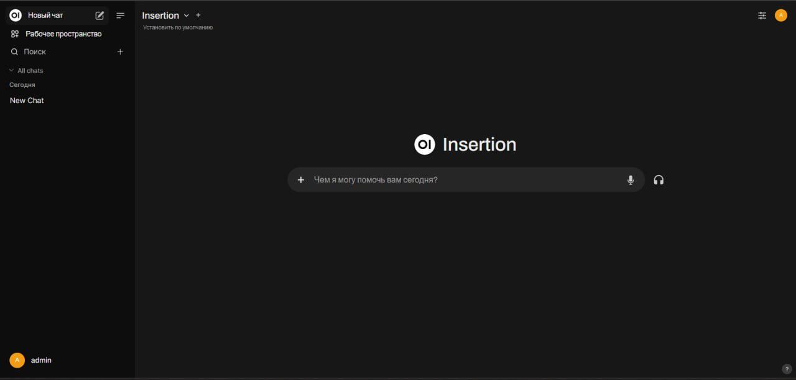
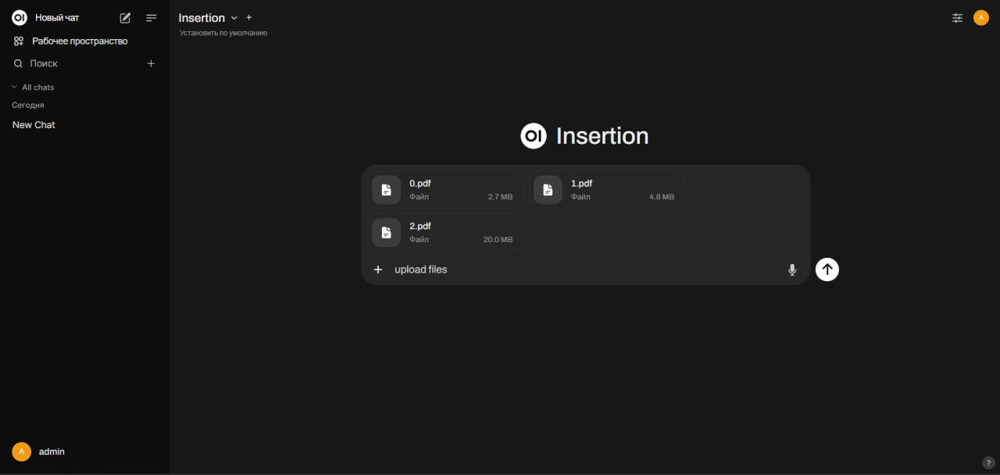
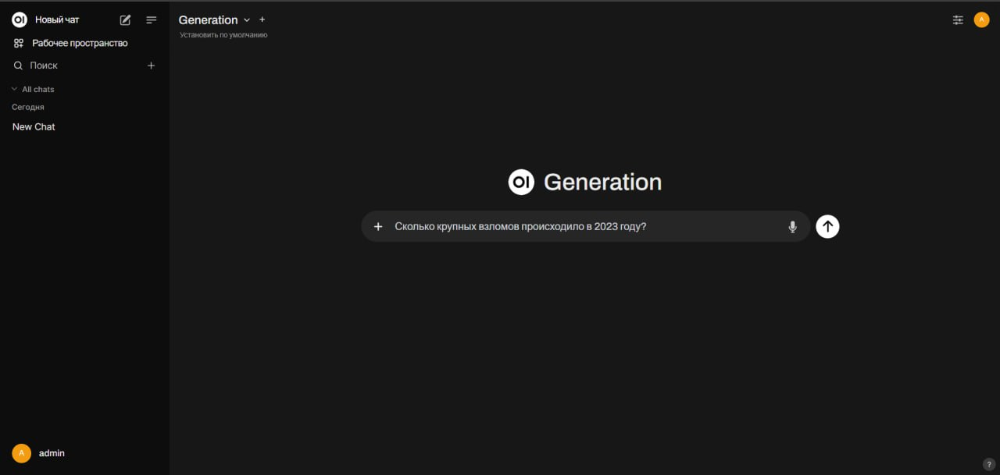

# Media_Wise_Hackaton
# Project structure 
```commandline
.
├── benchmarking
│   ├── data
│   │   └── benchmarking_dataset.csv
│   ├── evaluate_pipe.py
│   └── requirements.txt
├── embedder
│   ├── Dockerfile
│   ├── inference.py
│   └── requirements.txt
├── llm
│   ├── Dockerfile
│   ├── inference.py
│   ├── prompts.py
│   └── requirements.txt
├── OpenWebUI
│   └── pipelines
│       ├── generation.py
│       ├── insertion.py
│       └── requirements.txt
├── reranker
│   ├── Dockerfile
│   ├── inference.py
│   └── requirements.txt
├── README.md
├── docker-compose.yml
└── Dockerfile-openwebui-pipeline

```
# Project launch 
## Requirements
`Python version >= 3.11` </br>
`Docker engine` </br>
`.env` file in project root with such structure:
```commandline
IAM_TOKEN=<your_personal_iam_token>
```
## Launch commands 
```commandline
docker compose up --build 
```

## Usage 
By now the project is up and running. To start using it go to `http://localhsot:3057` </br>
Select `Insertion` option in toggle menu:

Using `+` symbol upload files and send `upload file` message:

After this you are good to go! </br>
Navigate to `Generation` option in toggle menu and write your prompt:

Send message and enjoy your answer!
# Benchmarking
You need to run all the containers via `docker compose` as listed above. </br>
Additionally you have to upload files to the knowledge base.
## Launch commands
```commandline
cd ./benchmarking
pip install -r requirements.txt
python evaluate_pipe.py
```
## Results 
The results will be printed in script execution logs and also saved `./data` folder as `benchmarking_results.csv`.